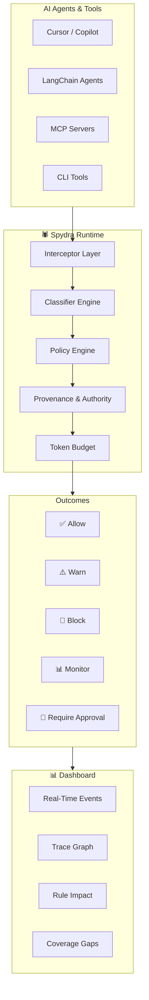

<div align="center">

# 🕷️ Spydra

### *The web that watches your AI agents.*

[](https://devfolio.co)
[](LICENSE)
[](https://python.org)
[](https://react.dev)
[](https://fastapi.tiangolo.com)

<br />

**Runtime governance layer for AI agents, tools, and MCP servers.**  
Every tool call is a strand. Spydra sits at the center — observing, scoring, and severing  
the ones that should never reach production.

<br />

[Quick Start](#-quick-start) · [Features](#-features) · [Architecture](#-architecture) · [Demo](#-demo) · [Tech Stack](#-tech-stack)

</div>

---

## 🎯 The Problem

Your developers are running AI agents — **Cursor, Copilot, custom LangChain workflows** — all making tool calls, HTTP requests, running shell commands, and talking to MCP servers.

**Nobody knows what they're doing.**

- No inventory of what agents can touch
- No visibility when one does something unexpected
- No enforcement when a new capability quietly appears
- No audit trail of what happened and why

Now multiply that by a team of ten. Each with agents that have MCP access to your infrastructure.

**That's where Spydra comes in.**

---

## ✨ Features

### 🕸️ Runtime Governance Engine
> Every action passes through Spydra's web before execution

| Capability | What Spydra Does |
|-----------|-----------------|
| **Tool Call Interception** | Catches MCP/Python tool calls before execution |
| **HTTP/API Governance** | Monitors outbound calls via `requests`/`httpx`/`urllib` with payload classification |
| **Subprocess Control** | Intercepts shell commands before they run |
| **Filesystem Guarding** | Classifies sensitive writes (`WRITE_CI` / `WRITE_CONFIG` / `WRITE_CODE`) |
| **LLM Call Monitoring** | Tracks provider transport (OpenAI, Anthropic) with token budget enforcement |
| **MCP Server Governance** | Gateway enforcement for downstream MCP tool calls |
| **CLI Tool Wrapping** | `kubectl`, `terraform`, `aws`, `gcloud`, `git`, `docker`, `cursor` — via `spydra session` |

### 🛡️ Policy Engine
Flexible JSON-based policies with four outcome tiers:

```
Block → Warn → Monitor → Allow
```

First match wins. Budget rules cap LLM spend per session, daily, or monthly.

### 🔍 Provenance-Aware Authority Flow
Spydra doesn't just ask *"is this agent allowed to use this tool?"*  
It asks *"was the information that **caused** this call authorized to exercise that power?"*

Protects against **Ghostjacking-style chains** where untrusted content influences agents into exercising their legitimate privileges maliciously.

### 🌐 Web Shield (Browser Agent Security)
Websites can expose tools to browser agents via WebMCP. Spydra's Web Shield:
- Scans every registration and output for prompt injection
- Detects Unicode obfuscation and capability mismatch
- Explainable 0–100 risk scoring
- Same policy engine: `allow` / `warn` / `sanitise` / `require_approval` / `block`

### 📊 Real-Time Dashboard
An immersive, spider-themed mission control center:
- **Live event stream** with trace replay
- **Sankey flow visualization** (agent → tool → outcome)
- **Rule impact heatmaps** with drilldown
- **Coverage gap analysis** — find blind spots in your policy
- **Token budget monitoring** — track LLM spend in real time
- **MCP tool inventory** — discover and audit all registered tools

---

## 🏗️ Architecture



---

## 🚀 Quick Start

### One Command Demo

```bash
pip install varden
varden demo
```

Spydra starts, bootstraps a baseline policy, runs demo agents, and opens the dashboard showing blocked, warned, and monitored actions.

### From Source

```bash
git clone https://github.com/your-team/spydra.git
cd spydra
python -m venv .venv && source .venv/bin/activate  # Linux/macOS
# OR: python -m venv .venv && .venv\Scripts\activate  # Windows
pip install -e .
varden demo
```

### Protect Your Python Agents

```python
import varden

varden.protect()

# Everything below is now intercepted, checked against policy, and logged.
# Nothing changes in your code. Everything changes in your visibility.
import requests
requests.post("https://partner.example/api", json={"token": "abc123"})
```

### Wrap CLI Tools

```bash
export VARDEN_BASE_URL=http://127.0.0.1:8000
export VARDEN_API_KEY=admin-demo-key
varden session . -- cursor .
```

Every subprocess, HTTP request, and LLM call that Cursor makes now appears in your dashboard.

---

## 🖥️ Dashboard

| Page | Description |
|------|-------------|
| **Overview** | Real-time event stream, trace replay, Sankey flows, metric cards |
| **Rule Impact** | Heatmap of live policy impact with per-rule drilldown |
| **Rules Workspace** | Visual policy editor with template import and JSON view |
| **Coverage Gaps** | Observed behavior with little or no policy coverage |
| **Web Shield** | WebMCP governance: registrations, invocations, findings |
| **Authority & Provenance** | Causal chain analysis and authority violation detection |

**Access Points:**
- Dashboard: `http://127.0.0.1:8000/`
- Rules Editor: `http://127.0.0.1:8000/ui/rules`
- API Docs: `http://127.0.0.1:8000/docs`
- Bootstrap Key: `admin-demo-key`

---

## 📋 Policy Model

```json
{
  "block": [
    { "type": "tool_call", "tool": "delete_database" },
    { "type": "tool_call", "tool": "subprocess.run", "field:args.args": { "contains": "rm -rf" } }
  ],
  "warn": [
    { "classifier:secrets": true },
    { "classifier:internal": true }
  ],
  "monitor": [],
  "allow": [],
  "budget_rules": [
    {
      "id": "session-cap",
      "type": "token_budget",
      "limit_usd": 10.0,
      "window": "session",
      "hard_cap": true
    }
  ]
}
```

---

## 🛠️ Tech Stack

| Layer | Technology |
|-------|-----------|
| **Backend** | Python 3.10+, FastAPI, Uvicorn |
| **Frontend** | React 19, TypeScript, Vite |
| **Database** | SQLite (default) / PostgreSQL (production) |
| **Auth** | JWT + API Key (HMAC-signed approvals) |
| **Integrations** | LangChain, OpenAI, Anthropic, MCP |
| **Deployment** | Docker, self-hosted |

---

## 🔌 Integrations

### LangChain

```python
from varden_langchain import protect_tools

tools = protect_tools(tools, agent_name='support-agent')
```

### MCP Gateway

```bash
varden mcp wrap ~/.cursor/mcp.json --output /tmp/mcp.wrapped.json
```

### Token Budgets

```bash
varden budget status    # Check active budget rows
```

---

## 🏠 Self-Hosting

```bash
docker compose -f deploy/docker-compose.yml up
```

Spydra runs entirely on your infrastructure. Your policy, your data, your control plane.  
**No traffic leaves unless you decide it does.**

---

## 📂 Project Structure

```
spydra/
├── varden/              # Core Python package
│   ├── api.py           # FastAPI application
│   ├── policy.py        # Policy engine
│   ├── classification.py # Action classifiers
│   ├── provenance/      # Authority & provenance
│   ├── webshield/       # Browser agent security
│   └── web/             # Static dashboard assets
├── frontend/            # React dashboard (Vite + TypeScript)
│   ├── src/
│   │   ├── components/  # UI & dashboard components
│   │   ├── styles/      # Spydra design system
│   │   └── lib/         # Utilities & types
├── varden_sdk/          # Python SDK
├── varden_langchain/    # LangChain integration
├── varden_mcp/          # MCP server implementation
├── varden_monitor/      # CLI session monitoring
├── policy-packs/        # Pre-built policy templates
├── demos/               # Demo scripts & examples
└── docs/                # Documentation
```

---

## 🤝 Contributing

We welcome contributions! See [CONTRIBUTING.md](CONTRIBUTING.md) for guidelines.

1. Fork the repository
2. Create a feature branch (`git checkout -b feature/amazing-feature`)
3. Commit your changes (`git commit -m 'Add amazing feature'`)
4. Push to the branch (`git push origin feature/amazing-feature`)
5. Open a Pull Request

---

## 📄 License

Licensed under the [Apache License 2.0](LICENSE).

---

<div align="center">

**Built with 🕸️ at HackVerse**

*Every agent action is a strand. Watch what it attempts, why Spydra scores it, and how policy cuts — or keeps — the thread.*

</div>
